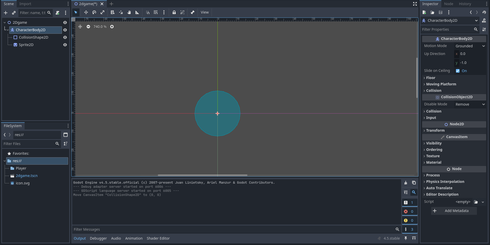

# Entry 1
##### 11/16/25

### Content 
Coming into my 3rd year of this course, researching a tool with more freedom that is outside of javascript/java was more easier finding tools that I have a good fit for me. At first I choose godot, I came to the realization that this tool doesn't have that much code into it. It's more about creating a sprite and putting it into the correct directory so the sprite moves correctly.

I didn't stop researching there, I had another tool called gDevelop which also caught my eye. 

[Next](entry02.md)

[Home](../README.md)