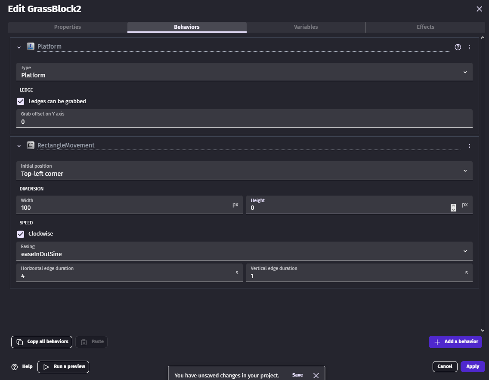
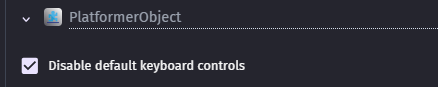
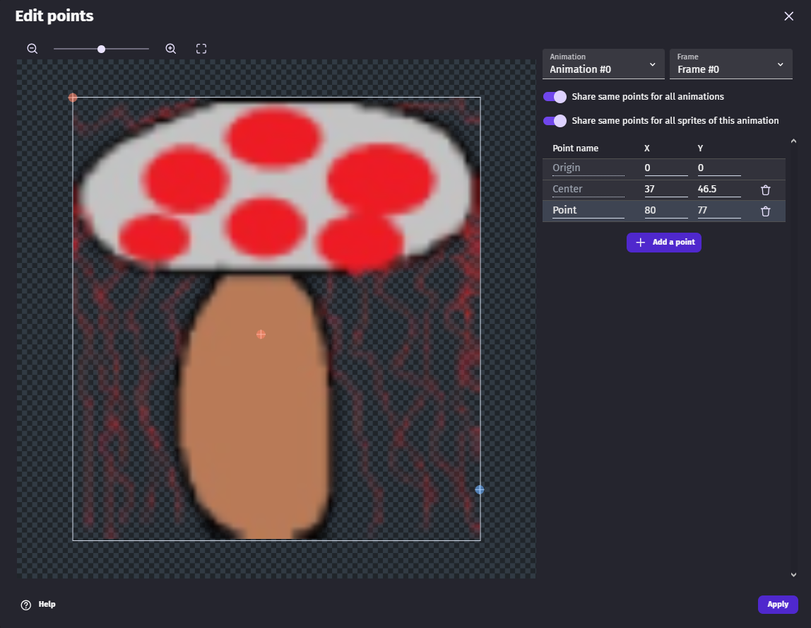
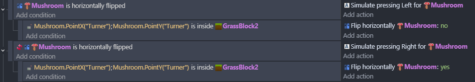

# Entry 2
##### 12/21/25
### Content
After selecting my tool, I started to learn the basics of the tool and how to create different sprites + behaviors then just a normal sprite. First I learned that when you create a new sprite, there is another tab for sprites that are used to make the ground for a platformer. In this sprite you actually have to create a behavior that it's a platform before placing the sprite on the scene. While in the behavior's tab you can also convert this platform into a moving platform.

* Making the height at 0 moves it left to right moving platform.
* Increasing the height higher than 0 makes the sprite moves up and left or right.
* Decreasing the height lower than 0 makes the sprite move down and left or right.
* You can increase or decrease the amount of time for the sprite to change directions by the horizontal edge duration and vertical edge duration.

Then I learned how create an enemy that moves back in front in a set distance. I created a sprite that was similar to the player sprite and in the behaviors section I would disable default keyboard controls so the enemy doesn't move when the user moves. 
   
* Then back to the properties tab I added a point which is located on the bottom left of the sprite to detect if the sprite hit something. The reason for this was when I would make a condition to change direction when the point hits another sprite. (The blue point is the point)
 
* Lastly, There is another file that just stores the conditions you want to make so the scene works as I intent to. I created a condition that if the enemy sprite is horizonally flipped, if it's facing and moving forward, I  added an action that when it checks if the point, on the enemy sprite, is touching the platform block to not horizonally flip it. Then I made another condition that if the enemy sprite is not horizonally flipped, I add an action that the enemy sprite gets horizonally flipped after checking if the point is touching the platform block.
 
As Christmas break approachs, there would be a lot of time for me to do some catch up since I missed 2 weeks of learning logs. My goals for this break is that I finish up learning all the basics of my tool and maybe start how to transition through different scenes to help me create my topic idea.
### Engineering Design Process
I am currently in my 2nd stage of my EDP process and in this stage I am researching the problem which is learning my tool. This will help me create a game to my desire topic,which is making a game where your actions causes the effect of the game.
### Skills
For the skills I learned, I enhanced my knowledge of how to learn and logical reasoning.
#### How to learn
Instead of just looking at the youtube video I was using to learn the basic of this tool, I would use when I saw in the video and try to recreate it with my own twist using the sprite png from my freedom project last year.
#### Logical Reasoning
While making conditions to make the enemy move back and forth in a set distance, I realized that I could do this my own and double check with the video to see If I got it right since it was simple if statement logic like I learn in java and javascript. There were somethings like calling the point and picking the correct move right action which I didn't know how to do so I used the video to help so I can adjust to how conditions works in this tool.
### Next Steps
As I said earlied Christmas break is approaching and I am excited to contining learning this tool because It's very beginnier friendly and I have more freedom on what I want to do. Before I ahead of myself, I want to finish with basics so I know what are the limits are to this tool and start learning all the fun stuff I can do with this tool.
[Previous](entry01.md) | [Next](entry03.md)

[Home](../README.md)