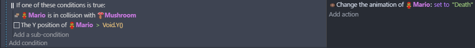
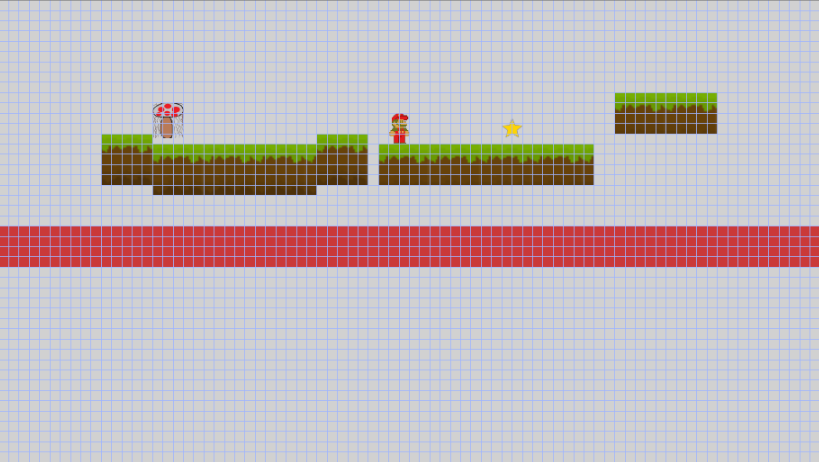
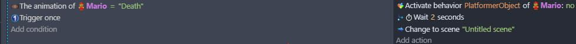

# Entry 3
##### 2/2/2026

### Content
After the Christmas break, I worked on my tool and caught up on the generally basics of GDevelop and learned mostly on the different actions you can on the event tabs. I learned how to traverse through different animation if the player got caught by a enemy or fall off the map. 

This is how to set the animation to the death animation which is similar to regular coding by adding an or in the condition. Void.Y() is a sprite that is created to set a boundary of how far out of bounds the player sprite can reach.
An example is:

The red bar is the so called "void"

 To make use of this change of animation we have to make it disable player movement and reset the scene. 

The first action goes into behavior of the player sprite (which in this case "Mario") and disable the player movement then the 2nd action waits a few seconds because I want the player to see the death animation then the 3rd action the scene resets by setting the fixed scene towards the current scene. Trigger once is also added in the conditions side to prevent an infinite loop that could potentially happen and break the game.

### Engineering Design Process
I am currently in my 2nd stage of my EDP process and in this stage I am researching the problem which is learning my tool. This will help me create a game to my desired topic,which is making a game where your actions cause the effect of the game.

### Skills
I enchanced my attention to detail and logical reasoning.
#### Attention to detail
Usually I would look at things and get the grasp of what am I learning but for these kinds of "events" I have to really pay attention on what sprite animation should this be or why does this 2 seconds before this action activate or why do I need this condition to trigger once only and why not just leave it be.
#### Logical Reasoning 
More than half of Gdevelop's function relies on the events tab and while looking at this for couple of months I haven't fully dived in this part of Gdevelop. This section of learning my tool showed me the different ways to use "if... then..." format. Such as changing animations, deactivating certain behaviors and even change scene with an easy click of a button.
### Next Steps
We are starting our MVP soon and I am pretty excited to code out what I want to do for this years MVP. Although senioritis is starting to kick in for me, I want to finish strong and atleast get out an MVP that I would be proud of. 

[Previous](entry02.md) | [Next](entry04.md)

[Home](../README.md)