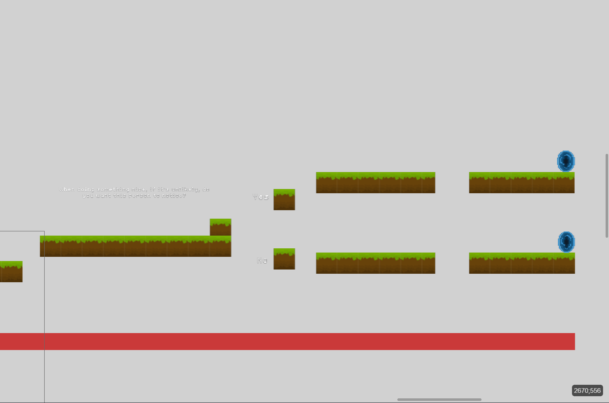
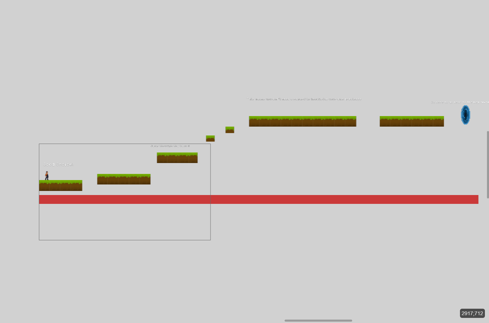
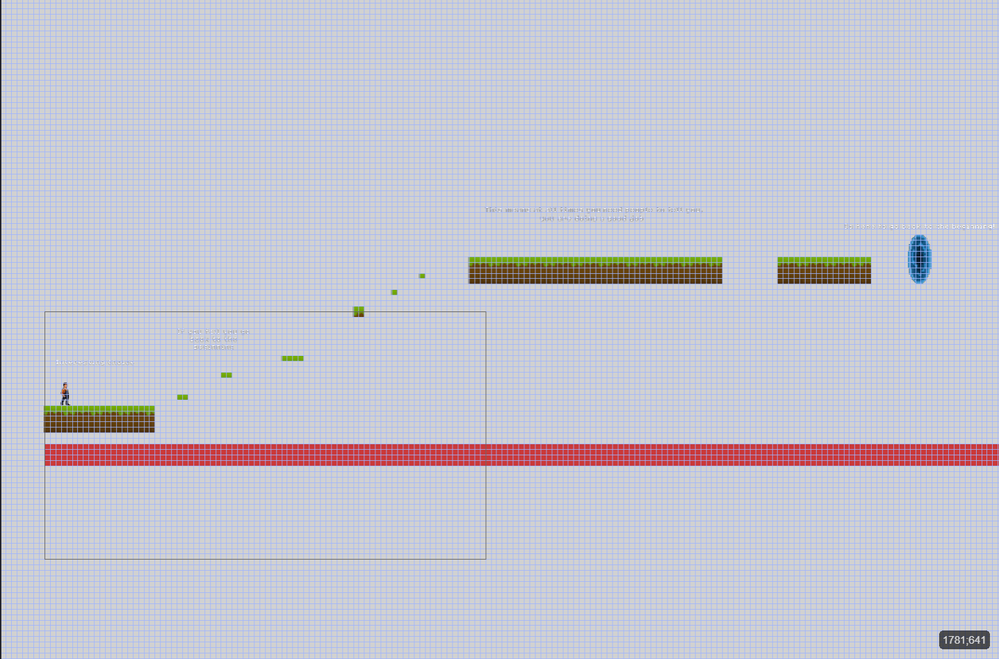
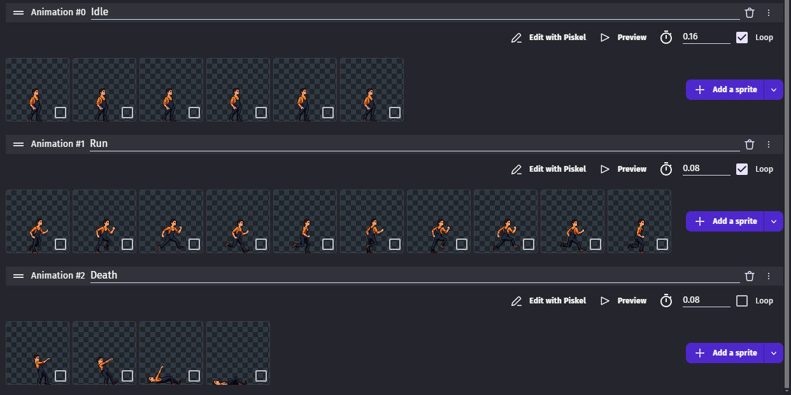
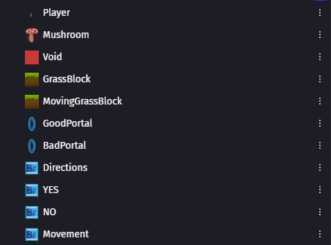

# Entry 5
##### 4/13/2026
After finishing my mvp, during the spring break and some days, and now we going to work on our beyond mvp and I have some ideas on what to work on. 
### MVP
For my mvp, I worked on the base of the game such as making the player make a decision like this. The portals go through different scenes. Each choice has different challenge based on the personality that is more healthier. 
 This is the healthier personality option. 
 This is the less healthier personality option. 

Then the player sprite is animated with these sprite sheets.

Lastly, I created 3 of the same sprite image for the ground and each of them had there own purpose. One was a regular ground to stand on, One was a moving platform and one is used for the player to jump through the block and land on it.
### Beyond MVP
Now onto my beyond mvp, I had in mind is that, there is a opportunity to change their option to their question, Add more questions, create a theme for each choice.
### EDP
I am currently on stage 7 of my Engineering Design Process and this stage is improving as needed. My mvp right now looks really bland so I want my mvp to look more appealing and have some sort of color.
### Skills
Throughout this process I enhanced my creativity and organization. 
#### Creativity
Througout building my mvp, I couldn't just put random sprites everywhere so I had to be somewhat unique about it, even if it was simple, to make my 2d game more entertaining to see what this game is about. With that thought in mind, I decided to make one very easy platform level and one hard platform level depending on my FP topic so I don't stray away from my topic. You can see what I came up with shown above.
#### Organization
On the right side of the GDevelop tool, that's where u store all your sprites and I tend to have multiple of the same pngs for different sprites. I realized that it's very bad if I just left them with all the same name and I have to trial and error each one to know which sprite does this, that, etc. Here is an example for one of my scenes:   
 
### Next Steps
As I mention before, I am in my beyond MVP phase and I am planning to complete one of the three beyond MVP plans I have for myself.

[Previous](entry04.md) | [Next](entry06.md)

[Home](../README.md)
