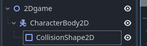

# Tool Learning Log

## Tool: **Godot**

## Project: **Creating a strategy game where there is many ways to beat the game**

---

### 10/5/25 Used [Youtube tutorial to explore 2d](https://www.youtube.com/playlist?list=PLfcCiyd_V9GH8M9xd_QKlyU8jryGcy3Xa)

* You can create a 2d "node" or a 3d "node" by selecting them at the left hand side of the screen.
* You can create a child node by right clicking on the main "node" or clicking the plus sign on the top left. This creates the entity, sprite, camera and many more.
    * When creating a character for example It needs a collsion and that collsion needs a shape.
    * to create that shape on the inspector on the right side of the screen click on the child "node" collsion and click empty option next to shape so you can select any shape available to you.
* You can also click the eye ball so that "node" would be invisible or visible.
    
* f5 runs the project.
* f6 runs the current scene.
* you could create a folder on the bottom left to store entities, sprite movements and etc. This is for organization.
* To create the sprite you need drag in the sprite sheets into the player file. You do that by right clicking on player folder open in file manager and then have another file explorer that has the sprite sheets and you drag it in. 
    * On godot you could see the sprite sheet and on the Sprite2D node you would drag it to the texture box on the right.
* Depending on how many horizontal sprites and vertical sprites frames you have, you type in the number in the animation tab under the inspector of the sprite node.
* If the sprite looks blurry on the project tab on the top right corner you go to the project settings and find textures so you can set the default filter to nearest.

Making a 2d game on godot looks not so beginner friendly but finding this step by step video on youtube makes it beginner friendly. I have so far created a sprite but haven't tried to make it move. Before I would go further into 2d, I want to explore the 3d verison of godot and potentally explore my back up tool gdevelop. 

### X/X/XX:
* Text

<!--
* Links you used today (websites, videos, etc)
* Things you tried, progress you made, etc
* Challenges, a-ha moments, etc
* Questions you still have
* What you're going to try next
-->
