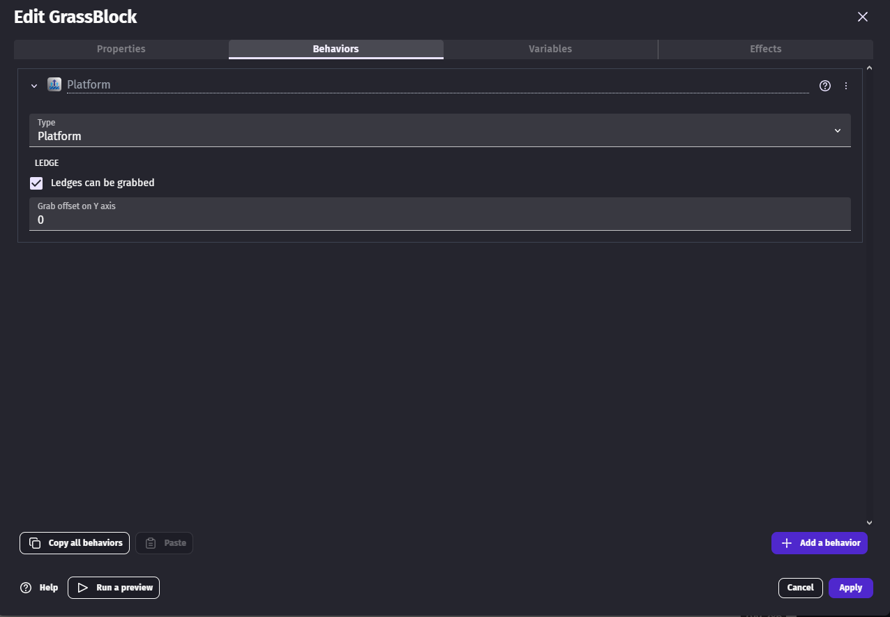
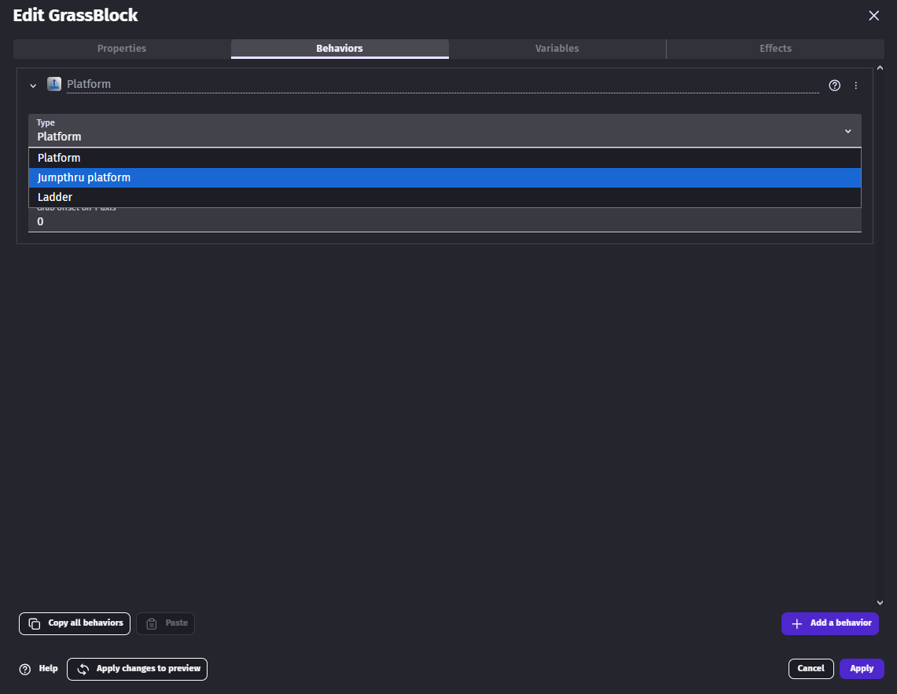
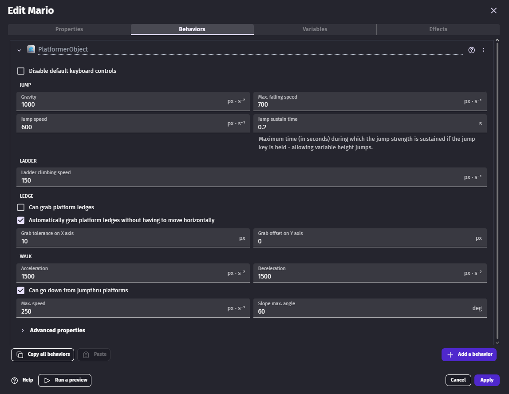
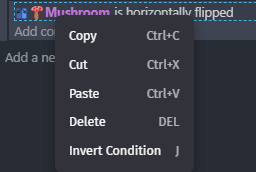
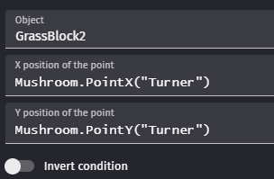
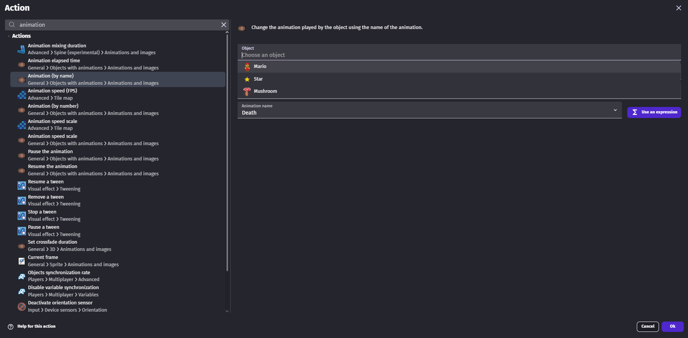
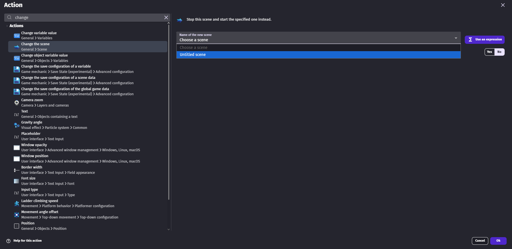
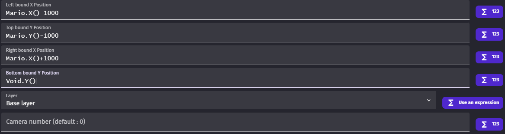

# Tool Learning Log

## Tool: **GDevelop**

## Project: **Create a 2d game where the player makes choices and those choices impact what they encounter.**

---
(When I was trying godot)
### 10/5/25 Used [Youtube tutorial to explore 2d](https://www.youtube.com/playlist?list=PLfcCiyd_V9GH8M9xd_QKlyU8jryGcy3Xa)

* You can create a 2d "node" or a 3d "node" by selecting them at the left hand side of the screen.
* You can create a child node by right clicking on the main "node" or clicking the plus sign on the top left. This creates the entity, sprite, camera and many more.
    * When creating a character for example It needs a collsion and that collsion needs a shape.
    * to create that shape on the inspector on the right side of the screen click on the child "node" collsion and click empty option next to shape so you can select any shape available to you.
* You can also click the eye ball so that "node" would be invisible or visible.

* f5 runs the project.
* f6 runs the current scene.
* you could create a folder on the bottom left to store entities, sprite movements and etc. This is for organization.
* To create the sprite you need drag in the sprite sheets into the player file. You do that by right clicking on player folder open in file manager and then have another file explorer that has the sprite sheets and you drag it in. 
    * On godot you could see the sprite sheet and on the Sprite2D node you would drag it to the texture box on the right.
* Depending on how many horizontal sprites and vertical sprites frames you have, you type in the number in the animation tab under the inspector of the sprite node.
* If the sprite looks blurry on the project tab on the top right corner you go to the project settings and find textures so you can set the default filter to nearest.

Making a 2d game on godot looks not so beginner friendly but finding this step by step video on youtube makes it beginner friendly. I have so far created a sprite but haven't tried to make it move. Before I would go further into 2d, I want to explore the 3d verison of godot and potentally explore my back up tool gdevelop. 

### 11/23/25 Used [Youtube tutorial to explore the different options](https://www.youtube.com/watch?v=XxeD_2nTyHI&t=139s)
* When you want to create a sprite you click an plus button at the right side of your screen and you can put in animations, how they move and jump and some extra variables you want to apply.
* You can also add spritesheets so the sprite moves when the sprite moves or stands still.
 
At the moment this is just the animation of the sprite not moving.
* Out of this screen (I can edit in the movements when I learn them) there is a events tab at the top of the screen. 
    * This events works like those if condition I learned in javascript and java. 

* You can also add another condition like && in javascript and java. At the point there isn't anything I found that as the same action as ||.
* When you create a sprite that the player stands on, you specficly have to click on "Tiled Sprite" and add your sprite from there. 
* Then you would set the tiled sprite to whatever the grid is on the whole screen. On default, it's 32 by 32 but you could change it to 16 by 16 to make it more manageable.
* When you try to expand a tiled sprite at every grid it duplicates the sprite while a regular sprite just becomes bigger. 
### 12/7/25 Used [Youtube tutorial again since there are more concept to be learnt](https://www.youtube.com/watch?v=XxeD_2nTyHI&t=139s)
* In addtion of making a titled sprite it doesn't right away allows the player sprite to stand on it. You have to add the behavior platform so the user can stand on it. 

* you can make the platform a jumpthough platform where you can go through the platform and land on it or a ladder which the player sprite can climb on.

* To make the sprite move you would need to create a behavior called PlatformerObject and you can configure the walkspeed, jumpspeed, falling speed and if you can grab on to ledges

* When creating a multiple platforms for the player sprite to jump to you need the camera to follow the player so the user knows where it's going.
    * You would need to add SmoothPlatformerCamera
    * You can configure the speed on the camera catching up to the player sprite. You can make it really fast so it's updated in real time or make it really slow (for some reason).
* You can also create moving platforms by making a seperate idenical sprite image or different for this sprite.
    * You would need to select the RectangleMovement
    * Making the height to 0 making it an actually moving platform.
    * Increasing the height higher to 0 makes the sprite moves up and left or right.
    * You can increase or decrease the amount of time for the sprite to change directions as well.

### 12/14/25 Used [Youtube tutorial again since I didn't touch on everything the person showed](https://www.youtube.com/watch?v=XxeD_2nTyHI&t=139s)
* To create a pick up sprite that can be collected after the player sprite goes over it, first you create a regular sprite with animations seen above.
    * Then In events tab on the top, you create an condition called collision and on the top you put the player sprite name and on the bottom you put the pick up sprite name. 
    * Lastly on the action you create an action called delete and select the pick up sprite.
    * When making pick up sprite you can select the sprite, hold ctrl and drag you mouse to a spot you want the pick up sprite to be to make a dupe.
* To create an enemy, it's the same thing as the player sprite but you would turn on default contorls and not add a smooth camera so it doesn't conflict with the camera on the player sprite.

* Then inside of the sprite you want to add a point located on the bottom left. This point will be used to detect if the sprite hit something.
    * You would click add a point and put the point close to the bottom of the sprite so when we create a condition to change direction It will be more accurate.(for reference look at blue point)
 
* On the events tab, We add a condition if enemy sprite is horizontally flipped then the action is simulate left key press.
    * Make sure simulate left key press has movement, platformer behavior, platformer controls as grey text directly below.
* Then we make the same condition but we reverse it by right clicking on the horizontally flipped and clicking invert condition so the action will be the opposite.

* Then for the action it would be simulate right key press instead of left
* In both of these conditions, we would make another condition called point inside object and we would select the platform block (preferably the block the enemy is going to be on) then check if the point we created earlier is touching the platform block.

* For the condition that if the enemy sprite is horizonally flipped you would add an action that when it checks if the point, on the enemy sprite, is touching the platform block to not horizonally flip it and for the other condition if the enemy is not horizonally flipped you add an action that the enemy sprite gets horizonally flipped.
 
### 1/2/25 Used [Youtube tutorial again since I didn't touch on everything the person showed](https://www.youtube.com/watch?v=XxeD_2nTyHI&t=139s)
* To make the player sprite reset back to the beginning if touched by a enemy sprite you first want to add a death animation by clicking on the player sprite and click add animation on the botton right corner to add the images of the death animation of the character. The animation should have a name because that will be important later.

* Then in the events tab add a condition when the player sprite collides with the enemy sprite it changes the animation to the death animation. To do that, search up animation and find "animation (by name)" then select the player sprite and the death animation.  

* Then create a new condition where when the player sprite equals to death animation by searching up animation and find "animation (by name)" then select the player sprite and select it's animation. Then on the action search for deactivate and select the player sprite and it's behavior (typically called platformer object) and click "no" on activate. This would make the player sprite not moveable at all since it died to the enemy.
* To reset to the beginning to the game, add another action that changes to the scene to the default scene (or whatever scene the player first spawns at). To do this, search up change scene and select the scene the player first spawns at. For me it's untitled scene.

* Since this automatically resets the scene and you can't see your player sprite death animation be seen you would add a 1-2 second timer before changing scene. To do this, add an action below the changing scene action and search "wait" and click on wait x seconds. Set it equal to 1 or 2 and move it before the scene change. 

* We also add a trigger once condition to avoid infinite loops. To add this condition you search up trigger and click on trigger once... then click ok. 
* When you fall off the map to reset the game you add a sprite that checks if the player character pasts that sprite.
* You can create a sprite with create with piskel and quickly make a sprite without having to find a blank image on the internet. 
* Then you want to spread the sprite under your game/level.

* Then in the events tab, you want to add a condition when the player sprite y is greater than the sprite being used to check if the player sprite went past it. 
    * You want to add this condition with changing the animation of the player sprite to death animation
    * You also want to add an or condition so the condition runs like they need to be.

* To hide the sprite to check if the player sprite went through it you add an boundary where the camera goes. To add a boundary, add an new action and search "enforce camera" and select on "enforce camera boundaries". Now set the axis to the following.

* Mario is the player sprite name and void is the sprite that checks if the player pasted the sprite.
* The numbers can be configured to my liking. 
<!--
* Links you used today (websites, videos, etc)
* Things you tried, progress you made, etc
* Challenges, a-ha moments, etc
* Questions you still have
* What you're going to try next
-->
